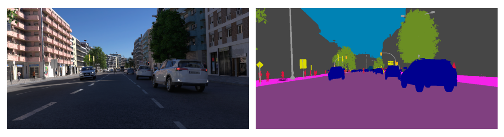

# Computer Vision

This repo is a collection of computer vision experiments with relevant datasets and SOTA AI models. It currently includes a SegFormer model, fine-tuned to perform a semantic segmentation task on the UrbanSyn dataset, a dataset of synthetic photorealistic rgb images of urban driving scenarios.

## Getting Started

### Installation

* Clone the repo with `git clone git@github.com:zaitsev136/computer-vision.git`
* Install `requirements.txt` with pip or conda. Tested on `python 3.11.9`

### GPU Support (CUDA)
If you want to train the models using GPU acceleration for faster performance, follow these steps:

1. **Install NVIDIA Drivers**: Ensure that your system has the latest NVIDIA drivers installed. You can download them from the [NVIDIA website](https://www.nvidia.com/en-us/drivers/).
2. **Install CUDA Toolkit**:
    * Install the CUDA Toolkit, e.g. version 12.4, from the [CUDA Toolkit download page](https://developer.nvidia.com/cuda-toolkit-archive).
    * Follow the instructions in the [CUDA Installation Guide](https://docs.nvidia.com/cuda/index.html) for your operating system.
3. **Install PyTorch with CUDA Support**: After installing the NVIDIA drivers and CUDA toolkit, install the CUDA-enabled version of PyTorch following the [PyTorch installation instructions](https://pytorch.org/get-started/locally/).
    * For example, for installation with `pip`, do:
`pip install torch torchvision --index-url https://download.pytorch.org/whl/cu124`.
    * For installation with `conda`, do:
`conda install pytorch torchvision pytorch-cuda=12.4 -c pytorch -c nvidia`

### Working with dataset

The datasets are heavy (UrbanSyn with rgb images and semantic segmentation maps is ~20 GB) and therefore not included into the repo. To train or validate the models, you need to download and optionally preprocess relevant datasets. See [Datasets](#datasets).

## Datasets

### UrbanSyn

Citing the [UrbanSyn wepbage](https://www.urbansyn.org), "UrbanSyn is an open synthetic dataset featuring photorealistic driving scenes. It contains ground-truth annotations for semantic segmentation, scene depth, panoptic instance segmentation, and 2-D bounding boxes."

In this work, we only use the RGB images and the correponding semantic segmentation maps. Here is an example:



#### Downloading the Dataset

The dataset is **not included** in the repository. However, the file [data_modules/urbansyn.py](data_modules/urbansyn.py) provides command-line tools to download and downscale the dataset.

To download the dataset, run:\
`python data_modules/urbansyn.py download`

To see options, run:\
`python data_modules/urbansyn.py download --help`

#### Preprocessing the Dataset

The original dataset contains images with a resolution of 1024 by 2048 pixels. To speed up the training, we resize the images by factors 2 or 4.

To perform the downscaling in advance (instead of during every training epoch), use:\
`python data_modules/urbansyn.py downscale`

Add `--help` to see more options.

## Models

### SegFormer

SegFormer is a transformer-based model for semantic segmentation introduced in [E. Xie, W. Wang, Z. Yu, A. Anandkumar, J. M. Alvarez, P. Luo, 2021](https://arxiv.org/pdf/2105.15203). SegFormer unifies Transformers with lightweight multilayer perceptron (MLP) decoders. The advatanges of the SegFormer are:
1. Positional-encoding-free and hierarchical Transformer encoder which outputs multiscale features, in contrast to a signle-scale low-resolution ViT features.
2. Computationally efficient MLP decoder.


The model is implemented in [models/segformer.py](models/segformer.py).

## Experiments

### Semantic Segmentation on UrbanSyn

Semantic segmentation is a computer vision task in which the goal is to categorize each pixel in an image into a class. We use the [NVIDIA SegFormer-B0](https://huggingface.co/nvidia/segformer-b0-finetuned-cityscapes-1024-1024) model pretrained on the [Cityscapes](https://www.cityscapes-dataset.com/) dataset and fine-tune it on the [UrbanSyn](#urbansyn) dataset. Both datasets provide segmentation maps for the following 19 classes:\
`'road', 'sidewalk', 'building', 'wall', 'fence', 'pole', 'traffic_light', 'traffic_sign', 'vegetation', 'terrain', 'sky', 'person', 'rider', 'car', 'truck', 'bus', 'train', 'motorcycle', 'bicycle'`

The file [urbansyn_segformer.py](experiments/urbansyn_segformer/urbansyn_segformer.py) wraps the pretrained model into a *PyTorch Lightning* `LightningModule` and provides the command line support for training, validating and running the model using the `LightningCLI`:

```bash
# to run the training, do
python experiments/urbansyn_segformer/urbansyn_segformer.py fit

# to run the validation of our best fine-tuned model, do
python experiments/urbansyn_segformer/urbansyn_segformer.py validate

# to run the validation of yoru own checkpoint, do
python experiments/urbansyn_segformer/urbansyn_segformer.py validate --ckpt_path your_checkpoint.ckpt

# to run the inference on your custom input, do
python experiments/urbansyn_segformer/urbansyn_segformer.py predict --input_path your_input.png [--output_path output_filename.png]

# to see all the options for fit, validate or predict, do
python experiments/urbansyn_segformer/urbansyn_segformer.py {fit, validate, predict} --help
```

See the [LightningCLI documentation](https://lightning.ai/docs/pytorch/stable/cli/lightning_cli.html#lightning-cli) for the detailed description of all the possible options.  

See the [experiments/urbansyn_segformer/train_segformer.ipynb](experiments/urbansyn_segformer/train_segformer.ipynb) jupyter notebook for the demonstation of the training, validation and inference.

After around 100 epochs, we reached a performance of 37.8% mean Intersection over Union metric. Below is an inference example on a google street view of Kalckreuthweg, Hamburg:


