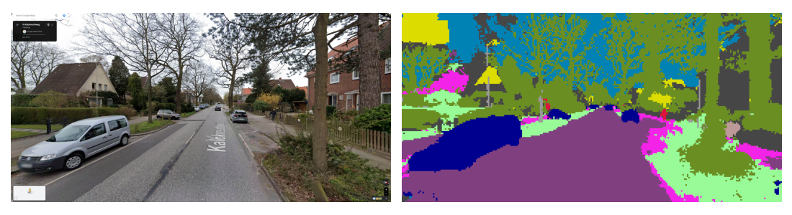

# Computer Vision

This repo is a collection of computer vision experiments with relevant datasets and SOTA AI models. It currently includes a SegFormer model, fine-tuned to perform a semantic segmentation task on UrbanSyn - a dataset of synthetic photorealistic images of urban driving scenarios.

## Getting Started

### Installation

Tested with `python 3.11.9`

* Clone the repo with `git clone git@github.com:zaitsev136/computer-vision.git`
* Create a virtual environment:\
`python - m venv .venv`
* Activate it:\
`./.venv/Scripts/activate` in PowerShell or `source .venv/bin/activate` in bash:
* Install requirements:\
`pip install -r requirements.txt`
* If you want to train and validate the models with GPU acceleration, upgrade torch to its CUDA version:\
`pip uninstall -y torch torchvision`\
`pip install torch torchvision --index-url https://download.pytorch.org/whl/cu124`

### Working with dataset

The datasets are heavy (UrbanSyn with rgb images and semantic segmentation maps is ~20 GB) and therefore not included into the repo. To train or validate the models, you need to download and optionally preprocess relevant datasets. See [Datasets](#datasets).

## Datasets

### UrbanSyn

Quoting the [UrbanSyn webpage](https://www.urbansyn.org), "UrbanSyn is an open synthetic dataset featuring photorealistic driving scenes. It contains ground-truth annotations for semantic segmentation, scene depth, panoptic instance segmentation, and 2D bounding boxes."

In this work, we only use the RGB images and the corresponding semantic segmentation maps. Here is an example:


#### Downloading the Dataset

The dataset is **not included** in the repository. However, the file [data_modules/urbansyn.py](data_modules/urbansyn.py) provides command-line tools to download and downscale the dataset.

To download the dataset, run:\
`python data_modules/urbansyn.py download`

To see options, run:\
`python data_modules/urbansyn.py download --help`

#### Preprocessing the Dataset

The original dataset contains images with a resolution of 1024 by 2048 pixels. To speed up the training, we resize the images by factors 2 or 4. To perform the downscaling in advance (instead of during every training epoch), use:\
`python data_modules/urbansyn.py downscale`

Add `--help` to see more options.

### Cityscapes

[Cityscapes](https://www.cityscapes-dataset.com/) is a large-scale dataset which focuses on semantic understanding of urban street scenes. The dataset consists of around 5000 fine annotated images. Data was captured in 50 cities during several months, daytimes, and good weather conditions.

In this work, we only use the RGB images and the corresponding semantic segmentation maps. Here is an example:


#### Downloading the Dataset

The dataset is **not included** in the repository. However, the file [data_modules/cityscapes.py](data_modules/cityscapes.py) provides command-line tools to download and downscale the dataset, provided you are registered on the [Cityscapes website](https://www.cityscapes-dataset.com/).

To download the dataset, run:\
`python data_modules/cityscapes.py download`

Add `--help` to see options.

#### Preprocessing the Dataset

The original dataset contains images with a resolution of 1024 by 2048 pixels. To speed up the training, we resize the images by factors 2 or 4. To perform the downscaling in advance (instead of during every training epoch), use:\
`python data_modules/cityscapes.py downscale`

Add `--help` to see options.

## Models

### SegFormer

SegFormer is a transformer-based model for semantic segmentation introduced in [E. Xie, W. Wang, Z. Yu, A. Anandkumar, J. M. Alvarez, P. Luo, 2021](https://arxiv.org/pdf/2105.15203). SegFormer unifies Transformers with lightweight multilayer perceptron (MLP) decoders. The advantages of the SegFormer are:
1. Positional-encoding-free and hierarchical Transformer encoder which outputs multiscale features, in contrast to a single-scale low-resolution ViT features.
2. Computationally efficient MLP decoder.


The model is implemented in [models/segformer.py](models/segformer.py).

## Experiments

### Semantic Segmentation on UrbanSyn

Semantic segmentation is a computer vision task in which the goal is to categorize each pixel in an image into a class. We use the [NVIDIA SegFormer-B0](https://huggingface.co/nvidia/segformer-b0-finetuned-cityscapes-1024-1024) model pretrained on the [Cityscapes](https://www.cityscapes-dataset.com/) dataset and fine-tune it on the [UrbanSyn](#urbansyn) dataset. Both datasets provide segmentation maps containing the following 19 classes:\
`'road', 'sidewalk', 'building', 'wall', 'fence', 'pole', 'traffic_light', 'traffic_sign', 'vegetation', 'terrain', 'sky', 'person', 'rider', 'car', 'truck', 'bus', 'train', 'motorcycle', 'bicycle'`

The file [urbansyn_segformer.py](experiments/urbansyn_segformer/urbansyn_segformer.py) wraps the pretrained model into a *PyTorch Lightning* `LightningModule` and provides the command line support for training, validating and running the model using the `LightningCLI`:

```bash
# to run the training, do
python experiments/urbansyn_segformer/urbansyn_segformer.py fit

# to run the validation of our best fine-tuned model, do
python experiments/urbansyn_segformer/urbansyn_segformer.py validate

# to run the validation of your own checkpoint, do
python experiments/urbansyn_segformer/urbansyn_segformer.py validate --ckpt_path your_checkpoint.ckpt

# to run the inference on your custom image, do
python experiments/urbansyn_segformer/urbansyn_segformer.py predict --input_path your_image.png [--output_path output_filename.png]

# to see all the options for fit, validate or predict, do
python experiments/urbansyn_segformer/urbansyn_segformer.py {fit, validate, predict} --help
```

See the [LightningCLI documentation](https://lightning.ai/docs/pytorch/stable/cli/lightning_cli.html#lightning-cli) for the detailed description of all the possible options.  

See the [experiments/urbansyn_segformer/train_segformer.ipynb](experiments/urbansyn_segformer/train_segformer.ipynb) jupyter notebook for the demonstration of the training, validation and inference.

After around 100 epochs, we reached 61.7% mean Intersection over Union metric, and 92.9% overall classification accuracy. Below is an inference example on a google street view of Kalckreuthweg, Hamburg:



## TL;DR

```bash
# to predict a segmentation map of your RGB image of a street, do:
python experiments/urbansyn_segformer/urbansyn_segformer.py predict --input_path your_image.png
```
