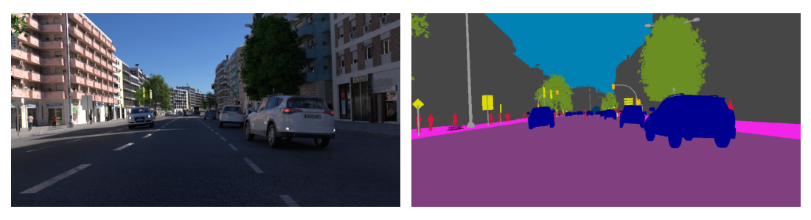
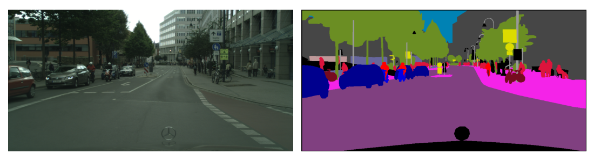

# Datasets

The `data_modules` module provide command-line tools to download and preprocess images from computer vision datasets used in this project. Additionally, it provides `LightningDataModule` subclasses to access the dataset when working with the `pytorch_lightning` framework.

The following datasets are included:
- [UrbanSyn](#urbansyn)
- [Cityscapes](#cityscapes)

## UrbanSyn

Quoting the [UrbanSyn webpage](https://www.urbansyn.org), "UrbanSyn is an open synthetic dataset featuring photorealistic driving scenes. It contains ground-truth annotations for semantic segmentation, scene depth, panoptic instance segmentation, and 2D bounding boxes."

In this project, we only use the RGB images and the corresponding semantic segmentation maps. Below is an example from the validation dataset:

### Downloading the Dataset

The dataset is **not included** in the repository. However, the file [data_modules/urbansyn.py](urbansyn.py) provides command-line tools to download and downscale the dataset.

To download the dataset, run:\
`python data_modules/urbansyn.py download`

To see options, run:\
`python data_modules/urbansyn.py download --help`

### Preprocessing the Dataset

The original dataset contains images with a resolution of 1024 by 2048 pixels. To speed up the training, we resize the images by factors 2 or 4. To perform the downscaling in advance (instead of during every training epoch), use:\
`python data_modules/urbansyn.py downscale`

Add `--help` to see more options.

### LightningDataModule

`data_modules/urbansyn.py` also provides the `UrbanSynDataModule` class, which is a `LightningDataModule`, convenient when working within the `pytorch_lightning` framework.

## Cityscapes

[Cityscapes](https://www.cityscapes-dataset.com/) is a dataset containing RGB images captured in 50 cities during several months, daytimes, and good weather conditions,
accompanied by manually created fine segmentation maps. The original dataset contains a few additional things, but in this project we work only with the RGB images and the corresponding segmentation maps.
Here is an example:

### Downloading the Dataset

To download the dataset, you need to register at the [Cityscapes website](https://www.cityscapes-dataset.com/) and request the access to the dataset.
After that you can download the dataset using [data_modules/cityscapes.py](cityscapes.py):

`python data_modules/cityscapes.py download`

Add `--help` to see options.

### Preprocessing the Dataset

Similarly to the UrbanSyn dataset, we provide a command-line tool to downscale the images and their corresponding segmentation maps:

`python data_modules/cityscapes.py downscale [--factors downscale_factors]`

### LightningDataModule

`data_modules/cityscapes.py` provides a `LightningDataModule` class called `CityscapesDataModule`, to be used within the `pytorch_lightning` framework.